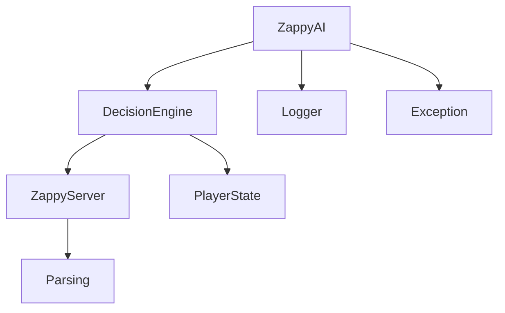

# Documentation Zappy AI

## 📋 Table des matières

1. [Vue d'ensemble](#vue-densemble)
2. [Architecture du projet](#architecture-du-projet)
3. [Installation et compilation](#installation-et-compilation)
4. [Utilisation](#utilisation)
5. [Architecture logicielle](#architecture-logicielle)
6. [Moteur de décision](#moteur-de-décision)
7. [Système de communication](#système-de-communication)
8. [Gestion des états du joueur](#gestion-des-états-du-joueur)
9. [Constantes et configuration](#constantes-et-configuration)
10. [Développement et débogage](#développement-et-débogage)
11. [API et fonctions principales](#api-et-fonctions-principales)

---

## 🎯 Vue d'ensemble

**Zappy AI** est un client intelligent développé en Python pour le jeu Zappy d'EPITECH. Il s'agit d'une intelligence artificielle capable de jouer de manière autonome au jeu Zappy, en prenant des décisions stratégiques pour survivre, évoluer et collaborer avec d'autres joueurs.

### Objectifs principaux

- **Survie** : Gérer les ressources alimentaires pour rester en vie
- **Évolution** : Collecter les pierres nécessaires pour augmenter de niveau
- **Reproduction** : Créer de nouveaux joueurs pour l'équipe (fork)
- **Collaboration** : Communiquer avec les autres joueurs pour les rituels d'élévation

### Fonctionnalités clés

- ✅ Prise de décision intelligente basée sur l'état actuel
- ✅ Gestion automatique de l'inventaire et des ressources
- ✅ Communication inter-joueurs via broadcast
- ✅ Pathfinding pour naviguer vers les ressources
- ✅ Gestion des rituels d'élévation collaboratifs
- ✅ Système de survie et de reproduction
- ✅ Architecture modulaire et extensible

---

## 🏗️ Architecture du projet

```
Zappy-AI/
├── build.sh                    # Script de compilation
├── CMakeLists.txt             # Configuration CMake
├── LICENSE                    # Licence du projet
├── README.md                  # Documentation de base
├── DOCUMENTATION.md           # Cette documentation
└── src/
    ├── main.py               # Point d'entrée principal
    ├── exec/                 # Module d'exécution C
    │   ├── exec.c           # Wrapper d'exécution Python
    │   ├── exec.h           # Headers C
    │   ├── get_linux_path.c # Gestion des chemins Linux
    │   └── get_macos_path.c # Gestion des chemins macOS
    └── zappy/               # Package Python principal
        ├── __init__.py      # Initialisation et constantes
        ├── ai.py           # Classe principale ZappyAI
        ├── decision_engine.py # Moteur de décision
        ├── exception.py     # Gestion des exceptions
        ├── logger.py       # Système de logs
        ├── parsing.py      # Parseurs pour les messages serveur
        ├── player.py       # État et gestion du joueur
        └── server.py       # Communication avec le serveur
```

---

## 🔧 Installation et compilation

### Prérequis

- **Python 3.8+** avec les modules standard
- **CMake 3.16+**
- **Compilateur C** (GCC ou Clang)
- **Make**

### Compilation

#### Compilation Release (recommandée)
```bash
./build.sh
```

#### Compilation Debug
```bash
./build.sh debug
```

#### Compilation manuelle avec CMake
```bash
mkdir -p build
cd build
cmake .. -DCMAKE_BUILD_TYPE=Release
make -j$(nproc) zappy_ai
```

### Résultat de la compilation

La compilation génère l'exécutable `zappy_ai` à la racine du projet, qui est un wrapper C qui lance le script Python principal.

---

## 🚀 Utilisation

### Syntaxe de base

```bash
./zappy_ai -p <port> -n <team_name> [-h <host>]
```

### Paramètres

| Paramètre | Description | Requis | Défaut |
|-----------|-------------|---------|---------|
| `-p, --port` | Port du serveur Zappy | ✅ Oui | - |
| `-n, --name` | Nom de l'équipe à rejoindre | ✅ Oui | - |
| `-h, --host` | Adresse du serveur | ❌ Non | `localhost` |
| `-v, --version` | Afficher la version | ❌ Non | - |

### Exemples d'utilisation

```bash
# Connexion locale avec l'équipe "TeamA"
./zappy_ai -p 4242 -n TeamA

# Connexion distante
./zappy_ai -p 4242 -n TeamA -h 192.168.1.100

# Afficher la version
./zappy_ai --version
```

### Codes de retour

- **0** : Exécution réussie
- **84** : Erreur (erreur de connexion, paramètres invalides, etc.)

---

## 🧠 Architecture logicielle

### Diagramme des classes principales



### Classes principales

#### 1. **ZappyAI** (`ai.py`)
- **Rôle** : Classe principale et point d'entrée
- **Responsabilités** :
  - Initialisation du client
  - Boucle principale du jeu
  - Gestion des interruptions utilisateur

#### 2. **DecisionEngine** (`decision_engine.py`)
- **Rôle** : Cerveau de l'IA
- **Responsabilités** :
  - Prise de décision stratégique
  - Planification des actions
  - Gestion des priorités

#### 3. **ZappyServer** (`server.py`)
- **Rôle** : Interface de communication
- **Responsabilités** :
  - Connexion TCP au serveur
  - Envoi/réception de messages
  - Gestion du protocole Zappy

#### 4. **PlayerState** (`player.py`)
- **Rôle** : État du joueur
- **Responsabilités** :
  - Inventaire et niveau
  - Vision du monde
  - Plans d'action

---

## 🎯 Moteur de décision

Le moteur de décision fonctionne selon un système de **priorités hiérarchiques**. À chaque itération, l'IA évalue les actions possibles dans l'ordre suivant :

### Ordre de priorité des décisions

1. **🔄 Réponse aux broadcasts** (`_respond_to_broadcast`)
   - Traite les messages des autres joueurs
   - Gère les invitations aux rituels

2. **👁️ Mise à jour de la vision** (`_update_vision`)
   - Obtient la vision actuelle si nécessaire
   - Commande : `Look`

3. **🍖 Survie** (`_survive`)
   - **Priorité** : Absolue
   - **Condition** : `food * 126 < FOOD_SURVIVAL_THRESHOLD`
   - **Actions** :
     - Chercher de la nourriture visible
     - Se déplacer vers la nourriture
     - Explorer si aucune nourriture visible

4. **👶 Reproduction** (`_reproduct`)
   - **Conditions** :
     - Nourriture suffisante (`food * 126 >= FOOD_SURVIVAL_THRESHOLD`)
     - Niveau ≥ 2
     - Timer de fork écoulé
   - **Action** : `Fork`

5. **⬆️ Élévation** (`_elevate`)
   - **Conditions** :
     - Toutes les pierres nécessaires disponibles
     - Nourriture suffisante pour le rituel
   - **Actions** :
     - Attendre d'autres joueurs si nécessaire
     - Broadcaster pour recruter
     - Lancer l'incantation

6. **💎 Collecte de ressources** (`_gather`)
   - Recherche les pierres manquantes pour l'élévation
   - Se déplace vers la ressource la plus proche
   - Met à jour l'inventaire

7. **🗺️ Exploration** (`_explore`)
   - Action par défaut
   - Mouvement vers l'avant avec déviations aléatoires
   - Découverte de nouvelles zones

### Algorithme de pathfinding

```python
def _get_path_to_tile(tile_index: int) -> list:
    """
    Calcule le chemin vers une case spécifique de la vision.
    Vision organisée en niveaux concentriques :
    
    Niveau 0: [0] (position actuelle)
    Niveau 1: [1, 2, 3] 
    Niveau 2: [4, 5, 6, 7, 8]
    etc.
    """
```

---

## 📡 Système de communication

### Protocole serveur

L'IA communique avec le serveur Zappy via TCP en utilisant le protocole textuel standard.

#### Commandes envoyées au serveur

| Commande | Description | Temps d'exécution |
|----------|-------------|-------------------|
| `Forward` | Avancer d'une case | 7 unités |
| `Right` | Tourner à droite | 7 unités |
| `Left` | Tourner à gauche | 7 unités |
| `Look` | Observer l'environnement | 7 unités |
| `Inventory` | Consulter l'inventaire | 1 unité |
| `Broadcast <msg>` | Diffuser un message | 7 unités |
| `Take <object>` | Prendre un objet | 7 unités |
| `Set <object>` | Poser un objet | 7 unités |
| `Fork` | Créer un nouveau joueur | 42 unités |
| `Incantation` | Lancer un rituel d'élévation | 300 unités |
| `Eject` | Éjecter les joueurs de la case | 7 unités |

#### Messages reçus du serveur

| Message | Signification |
|---------|---------------|
| `ok` | Commande exécutée avec succès |
| `ko` | Commande échouée |
| `dead` | Le joueur est mort |
| `message K, <msg>` | Message broadcast reçu |
| `Current level: K` | Niveau actuel après élévation |
| `{<inventaire>}` | État de l'inventaire |
| `[<vision>]` | Vision de l'environnement |

### Gestion de la file d'attente

```python
class ZappyServer:
    def __init__(self):
        self.command_queue = []      # Commandes à envoyer
        self.sent_commands = []      # Commandes envoyées en attente
```

- **Limite** : Maximum 10 commandes en attente
- **Stratégie** : FIFO (First In, First Out)
- **Gestion d'erreur** : Retry automatique sur échec

---

## 👤 Gestion des états du joueur

### Structure PlayerState

```python
class PlayerState:
    def __init__(self, team_name: str):
        self.level = 1                           # Niveau actuel (1-8)
        self.vision = []                         # Vision actuelle
        self.inventory = {}                      # Inventaire
        self.is_alive = True                     # État de vie
        self.world_width = 0                     # Largeur du monde
        self.world_height = 0                    # Hauteur du monde
        self.action_plan = []                    # Plan d'actions
        self.team_name = team_name               # Nom de l'équipe
        self.is_responding_to_broadcast = False  # Mode réponse broadcast
```

### Gestion de l'inventaire

L'inventaire contient les ressources suivantes :

| Ressource | Usage |
|-----------|--------|
| `food` | Survie (1 nourriture = 126 unités de temps) |
| `linemate` | Pierre d'élévation (tous niveaux) |
| `deraumere` | Pierre d'élévation (niveaux 2+) |
| `sibur` | Pierre d'élévation (niveaux 3+) |
| `mendiane` | Pierre d'élévation (niveaux 5+) |
| `phiras` | Pierre d'élévation (niveaux 4+) |
| `thystame` | Pierre d'élévation (niveau 7) |

### Vision et navigation

La vision est représentée sous forme de liste où chaque élément correspond à une case :

```
Vision niveau 2 :
    [4] [5] [6] [7] [8]
        [1] [2] [3]
            [0]
         (joueur)
```

---

## ⚙️ Constantes et configuration

### Exigences d'élévation

```python
ELEVATION_REQUIREMENTS = {
    # Niveau: (joueurs_requis, {pierres_requises})
    1: (1, {"linemate": 1}),
    2: (2, {"linemate": 1, "deraumere": 1, "sibur": 1}),
    3: (2, {"linemate": 2, "sibur": 1, "phiras": 2}),
    4: (4, {"linemate": 1, "deraumere": 1, "sibur": 2, "phiras": 1}),
    5: (4, {"linemate": 1, "deraumere": 2, "sibur": 1, "mendiane": 3}),
    6: (6, {"linemate": 1, "deraumere": 2, "sibur": 3, "phiras": 1}),
    7: (6, {"linemate": 2, "deraumere": 2, "sibur": 2, "mendiane": 2, 
           "phiras": 2, "thystame": 1}),
}
```

### Seuils de survie

```python
FOOD_SURVIVAL_THRESHOLD = 8 * 126  # 8 nourritures minimum
FORK_TIMER = 40  # Délai entre les forks
```

### Vitesses d'action

```python
ACTION_SPEED = [
    ["inventory"],                                          # 1 unité
    ["forward", "right", "left", "look", "broadcast",      # 7 unités
     "eject", "take", "set"],
    ["fork"],                                               # 42 unités
    ["incantation"]                                         # 300 unités
]
```

---

## 🔧 Développement et débogage

### Système de logging

Le système de logging permet de suivre l'exécution et déboguer l'IA :

```python
# Dans logger.py
import logging

logger = logging.getLogger("ZappyAI")
logger.setLevel(logging.DEBUG)

# Utilisation
logger.debug("Message de débogage")
logger.info("Information générale")
logger.warning("Avertissement")
logger.error("Erreur")
```

### Niveaux de log

- **DEBUG** : Détails des décisions et actions
- **INFO** : Événements importants
- **WARNING** : Situations à surveiller
- **ERROR** : Erreurs critiques

### Compilation en mode debug

```bash
./build.sh debug
```

Cette commande active :
- Symboles de débogage
- Logs détaillés
- Assertions supplémentaires

### Tests et validation

Pour tester l'IA :

1. **Lancer un serveur Zappy local**
2. **Démarrer l'IA avec des logs debug**
3. **Observer les décisions dans les logs**
4. **Valider le comportement attendu**

---

## 🔌 API et fonctions principales

### Classe ZappyAI

```python
class ZappyAI(DecisionEngine):
    def __init__(self, host: str, port: int, team_name: str)
    def run(self) -> bool
```

### Classe DecisionEngine

```python
class DecisionEngine(ZappyServer, PlayerState):
    # Pathfinding
    @staticmethod
    def _get_path_to_tile(tile_index: int) -> list
    
    # Recherche de ressources
    @staticmethod
    def _find_closest_ressource(vision: list[str], ressource_name: str) -> int
    
    # Validation d'élévation
    @staticmethod
    def _check_elevation_requirements(level: int, inventory: dict) -> dict
    
    # Fonctions de décision
    def _respond_to_broadcast(self) -> bool
    def _update_vision(self) -> bool
    def _survive(self) -> bool
    def _reproduct(self) -> bool
    def _elevate(self) -> bool
    def _gather(self) -> bool
    def _explore(self) -> bool
    
    # Moteur principal
    def make_decision(self) -> None
```

### Classe ZappyServer

```python
class ZappyServer:
    def __init__(self, host: str, port: int)
    def connect_to_server(self) -> None
    def initial_connection(self, team_name: str) -> tuple[int, int]
    def read_from_server(self) -> str
    def send_command(self, command: str) -> None
    def handle_server_message(self, message: str, state: PlayerState) -> None
```

### Classe PlayerState

```python
class PlayerState:
    def __init__(self, team_name: str)
    def update_inventory(self, inventory: dict) -> None
    def update_vision(self, vision: list) -> None
    def set_world_size(self, width: int, height: int) -> None
    def level_up(self) -> None
    def die(self) -> None
```

---

## 🚨 Gestion d'erreurs

### Exceptions personnalisées

```python
class ZappyError(Exception):
    def __init__(self, where: str, what: str):
        self.where = where  # Fonction où l'erreur s'est produite
        self.what = what    # Description de l'erreur
```

### Erreurs courantes

| Erreur | Cause | Solution |
|--------|-------|----------|
| `Connection denied` | Serveur inaccessible | Vérifier host/port |
| `Team can't have more members` | Équipe pleine | Changer de nom d'équipe |
| `Socket is not connected` | Perte de connexion | Redémarrer le client |

---

## 📈 Optimisations et stratégies

### Stratégies d'optimisation

1. **Gestion prédictive des ressources**
   - Anticiper les besoins futurs
   - Prioriser les ressources rares

2. **Collaboration intelligente**
   - Communication efficace via broadcast
   - Coordination pour les rituels

3. **Exploration optimisée**
   - Éviter les zones déjà explorées
   - Mouvement pseudo-aléatoire intelligent

4. **Gestion du timing**
   - Optimiser l'utilisation des unités de temps
   - Planifier les actions coûteuses

### Métriques de performance

- **Taux de survie** : Pourcentage de temps en vie
- **Vitesse d'élévation** : Temps moyen par niveau
- **Efficacité de collecte** : Ressources collectées / temps
- **Succès collaboratif** : Rituels réussis en équipe

---

## 🔮 Évolutions futures

### Améliorations possibles

1. **IA avancée**
   - Apprentissage automatique
   - Stratégies adaptatives
   - Prédiction des mouvements adverses

2. **Communication améliorée**
   - Protocole de communication d'équipe
   - Partage d'informations sur les ressources
   - Coordination tactique

3. **Interface graphique**
   - Visualisation en temps réel
   - Métriques de performance
   - Configuration interactive

4. **Tests automatisés**
   - Suite de tests complète
   - Simulation d'environnements
   - Benchmarking de performance

---

## 📞 Support et contribution

### Signaler un bug

1. Vérifier que le bug n'est pas déjà connu
2. Reproduire le bug de manière consistante
3. Fournir les logs complets
4. Décrire l'environnement d'exécution

### Contribuer au projet

1. Fork du repository
2. Créer une branche pour la fonctionnalité
3. Implémenter avec tests
4. Soumettre une pull request

### Ressources utiles

- **Documentation EPITECH Zappy** : Spécifications du jeu
- **Protocole réseau** : Format des messages serveur
- **Python 3 Documentation** : Référence du langage

---

## 📝 Notes de version

### Version 0.0.1 (Actuelle)
- ✅ Implémentation de base de l'IA
- ✅ Moteur de décision complet
- ✅ Communication serveur fonctionnelle
- ✅ Gestion des rituels d'élévation
- ✅ Système de reproduction
- ✅ Logging et débogage

### Roadmap

- **v0.1.0** : Optimisations de performance
- **v0.2.0** : IA collaborative avancée
- **v1.0.0** : Version stable complète

---

**Projet développé dans le cadre du cursus EPITECH**  
**Année** : 2025  
**Module** : B-YEP-400 - Zappy

*Cette documentation est maintenue et mise à jour régulièrement. N'hésitez pas à contribuer à son amélioration !*
